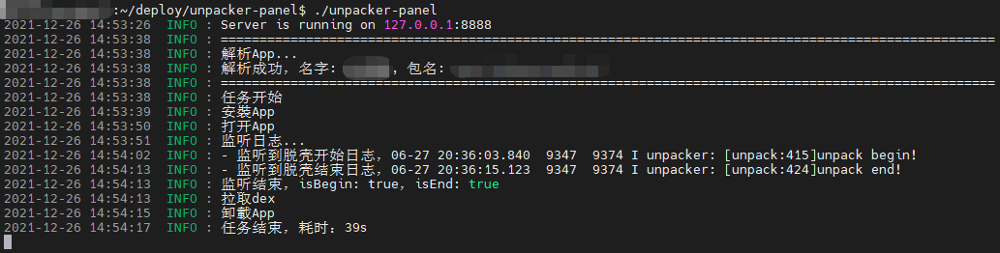

# Unpacker Panel

## 介绍
基于Youpk脱壳机的一键脱壳Web面板

- 目前仅支持单个设备控制，不支持并发和任务队列（如果并发会导致程序异常）  
- 可以先下载编译好的程序，支持 windows、linux（刚撸了几天代码还比较乱，暂时还未开源）
- **发行版入群下载：190033401**

## 说明

> 该工具仅仅用来学习交流, 请勿用于非法用途, 否则后果自付！

- adb `sudo apt install android-tools-adb`
- 电脑连接刷好Youpk的Pixel 1代，或者编译Youpk适配的其他安卓设备
- 运行程序，默认端口：8888（后台运行可以用 nohup / screen / tmux 等命令 ）
    ```batch
    unpacker-panel.exe
    unpacker-panel.exe --server.port=8888
    ```
- 浏览器访问 `http://ip:port`

## 截图

网页面板


后台日志



## 仓库

https://github.com/westinyang/unpacker-panel

## 最后

> 膜拜 Youlor 大佬提供的技术和思路，新人第一次来这发帖，开发这个东西本身也是在学习技术和实践应用，底层由 Youpk 强力驱动！

- [Youpk: 又一款基于ART的主动调用的脱壳机](https://bbs.pediy.com/thread-259854.htm)
